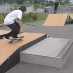
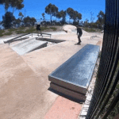
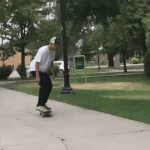
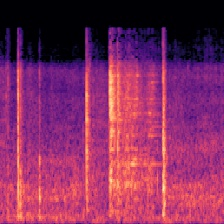

A two-stream model (RGB+audio) was trained to classify skateboard tricks from video clips. Deep Mind's [RGB-I3D model](https://github.com/deepmind/kinetics-i3d) was used for the RGB stream. For the audio stream, spectrogram images were first generated to represent the audio. Then, a CNN extracted the features from the spectrogram.

**The primary purpose of this project is to demonstrate how a two-stream model (RGB+audio) can produce a higher accuracy score than a single-stream model (RGB) on a given task.**

### Test Set Results

| Model | Top-1 Acc |
| --- | --- |
| RGB | 50.9 |
| RGB+audio | 62.3 |

# Implementation

## 1. RGB Model

The RGB-I3D model used in this project is from a Keras implementation created by [dlpbc](https://github.com/dlpbc/keras-kinetics-i3d). The model was pre-trained on ImageNet and Kinetics datasets.  

### Classes

* kickflip
* 360 kickflip
* 50-50
* nosegrind
* boardslide
* tailslide
* fail

 

 &nbsp;&nbsp;&nbsp;&nbsp;
 &nbsp;&nbsp;&nbsp;&nbsp;

 

*The three gifs above are examples of a kickflip, tailslide, and fail.*

### Dataset

The dataset consisted of video clips ranging from 1 to 4 seconds each. The training set was about 200 examples per class. 20% of the training set was randomly chosen to be used as the validation set. The test set was exactly 25 examples per class.

For each video clip, 64 frames were evenly subsampled. Experiments using 32 and 48 frames were conducted but achieved lower validation accuracies. GPU memory limitations prohibited experiments beyond 64 frames.

For the validation and test sets, each frame was center cropped with the length and width of the crop being the smaller dimension of the frame. The crop was then resized to 224x224. Aspect ratio was preserved.

For the training set, the size of the crop is determined in the same way as the validation and test sets but the location is chosen randomly for each video clip. All frames within the same video clip have the same crop location. Crop locations differ between video clips. Other forms of data augmentation were used such as horizontal flip, brightness, and zoom.

### Training

Since the training set is relatively small, overfitting the training set was a concern. Early experiments involved freezing layers to various depths before training the model. Surprisingly, unfreezing all layers yielded the highest accuracy on the validation set. The Adam optimizer was used with a small initial learning rate of 0.0001.

## 2. Audio Model

DenseNet121 (ConvNet), pretrained with ImageNet, was used.

The classes for the audio model are skateboard trick **types** and not skateboard tricks. All skateboard tricks fall into one of these 4 classes. Kickflip and 360 kickflip are air types. 50-50 and nosegrind are grind types. Boardslide and tailslide are slide types. Each skateboard trick type has their own distinct sound. For example, slide types involve contact between the skateboard wood and the obstacle (rail or ledge). Grind types involve contact between the metal part (trucks) of the skateboard and the obstacle. The main difference between fail types and the other three is that the sound of the skateboard rolling is not continuous in the video clip. The rolling sound usually stops when the skateboarder does not succesfully land the trick.

### Classes

* air
* grind
* slide
* fail

 

  
*Spectrogram of a grind.*

### Dataset

For each video clip (mp4 file), a WAV file was created. Then, a spectrogram image is created from the WAV file. A single audio channel is used, not stereo.

### Training

All layers were unfrozen during training.

## 3. RGB+Audio Model

The output of the last dense layer in the trained audio model is concatenated with the output of the RGB-I3D model.

The weights of the RGB-I3D model used in this RGB+audio model are initialized with the weights pre-trained on ImageNet and Kinetics datasets. i.e. The weights from the trained [1. RGB Model](#1.-RGB-Model) were not used to initialize the weights in this RGB+audio model.

### Classes

* kickflip
* 360 kickflip
* 50-50
* nosegrind
* boardslide
* tailslide
* fail

### Dataset

Same preprocessing as described in [1. RGB Model](#1.-RGB-Model) and [2. Audio Model](#2.-Audio-Model).

### Training

First, all layers in the audio model were frozen and all layers in the RGB-I3D model were unfrozen. The model was trained using Adam with a learning rate of 0.0001. Training was halted when the validation loss stopped decreasing.

Then, all layers in both models were unfrozen. The model finished training, but with a smaller learning rate of 0.00001. This approach increased the validation accuracy by about 2%.

# Results

The model metrics (accuracy, precision, recall, etc) on the test set can be found at the end of each Notebook.

* [RGB Model Notebook](https://github.com/michaelnation26/skateboard_trick_classification/blob/master/rgb_model.ipynb)
* [RGB+Audio Model Notebook](https://github.com/michaelnation26/skateboard_trick_classification/blob/master/rgb%2Baudio_model.ipynb)
