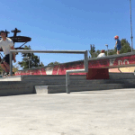
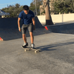
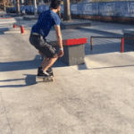
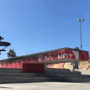
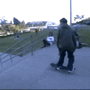

# Personal Dataset Predictions

After I completed this project, I thought it would be fun to test the RGB+Audio model on video clips of me skateboarding. I plan to update this page as I record more skateboard tricks in the future.

| Input | Actual | Prediction |
| --- | --- | --- |
|  | boardslide | boardslide |
|  | 360 kickflip | 360 kickflip |
|  | fail | fail |
|  | nosegrind | tailslide |
|  | 50-50 | tailslide |
